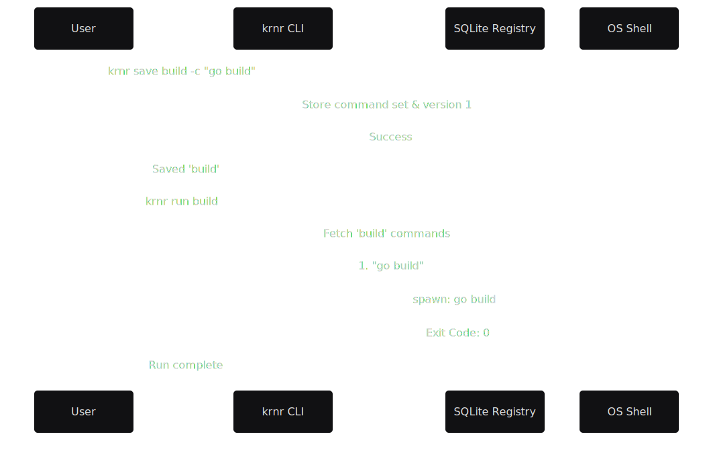

# krnr - Kernel Runner

_Record. Automate. Run._

[](https://github.com/VoxDroid/krnr/actions/workflows/ci.yml) [](https://github.com/VoxDroid/krnr/releases) [](https://github.com/VoxDroid/krnr/releases) [](https://github.com/VoxDroid/krnr) [](LICENSE) [](https://goreportcard.com/report/github.com/VoxDroid/krnr) [](https://pkg.go.dev/github.com/VoxDroid/krnr)

<p align="center">
  <a href="assets/gif/krnr.gif">
    
  </a>
</p>

**krnr** is a fast, cross-platform CLI that turns recurring terminal sequences into first-class, shareable workflows stored in a global, versioned SQLite registry. Save time, reduce one-off scripts and human error, and make your workflows reproducible, discoverable, and portable across machines, teams, and CI systems. It's approachable for everyone, start with a single saved command or the optional interactive TUI; no heavy configuration or background services required.

**Quick comparison - why krnr at a glance:**

- **Aliases**: Fast to add but per-shell and hard to discover or share.
- **Dotfiles / Scripts**: Flexible but scattered; sharing requires a repo or manual copying.
- **Task Runners** (Make, npm scripts): Great for project tasks but scoped to a repository.
- **krnr**: Global and cross-machine, highly discoverable (fuzzy search + `tui`), built-in snapshots & rollbacks, and simple to share via `export` / `import`.

---

## Why krnr?

Automating repeated terminal work often produces scattered scripts, fragile aliases, and per-project task files that are hard to find, maintain, and share. krnr provides a single global execution layer so your commands become:

- **Reproducible**: Versioned snapshots, full history and safe rollbacks for confident changes.
- **Discoverable**: Fuzzy search, tagging, and an interactive TUI make it fast to find the right workflow.
- **Shareable**: Export/import single-file workflows so teams run the exact same steps.
- **Safe & Auditable**: Confirmations, streaming logs, and recorded authorship for accountability.

**Who is it for?** Developers, SREs, operators, data scientists, and anyone who runs repeatable terminal tasks from single one-liners to complex runbooks. krnr is lightweight and approachable: start small with quick saved commands and adopt more features (TUI, versioning, export/import) as your needs grow.

**Use cases**:

* **Onboarding** — ship vetted, runnable workflows for new teammates.
* **CI parity** — run the same workflow locally and in automation.
* **Ops Runbooks** — capture maintenance and recovery as executable entries.
* **Cross-project Tasks** — standardize multi-step builds, deploys, and migrations.

---

## Key Features

Designed for everyone: CLI-first power with a discoverable TUI for fast exploration and safe execution. Lightweight, optional, and easy to start with one-liners.

- **Interactive Recording**: Capture complex terminal sessions in real-time with `krnr record`.
- **Interactive TUI**: `krnr tui` — fully interactive terminal UI to browse, describe, run (with streaming logs), save/edit, import/export, view history/rollbacks, and access installer views.
- **Dynamic Parameterization**: Inject variables at runtime using `--param key=value` or interactive prompts.
- **Auto-Versioning**: Every modification creates a version snapshot, allowing for instant rollbacks.
- **Native Shell Integration**: Intelligently selects the best shell (Bash, PowerShell Core, CMD) for your OS while allowing manual overrides.
- **Fuzzy Search & Tagging**: Organize hundreds of workflows with metadata-aware search and categorization.

---

## Quick Start

Start small: save and run a single command in seconds; no setup or external services required.

### 1. Installation
Install the binary and add it to your PATH automatically:

```bash
# Unix / macOS
./krnr install --user --add-to-path

# PowerShell / Windows
.\krnr.exe install --user --add-to-path
```

### 2. Save a Workflow
Persist a multi-step sequence with a single name:

```bash
krnr save deploy -d "Production deploy" -c "go test ./..." -c "go build -o app" -c "docker push registry/app"
```

### 3. Execute Anywhere
Run your saved workflow from any directory:

```bash
krnr run deploy --confirm
```

---

## Technical Architecture

krnr acts as a management layer between the user and the operating system's native shells.

### System Flow


### Execution Sequence


### Data Model


---

## Advanced Usage

### Runtime Parameters
You can use parameters in your commands to make workflows dynamic.

1. **Save a parameterized set**:
   `krnr save config -c "echo Current target: {{target}}"`

2. **Run with explicit value**:
   `krnr run config --param target=production`

3. **Run with Environment Variable**:
   `krnr run config --param target=env:DEPLOY_TARGET`

4. **Interactive Prompt**:
   `krnr run config` (if `target` is missing, krnr will prompt you for it).

---

## Configuration

krnr respects the following environment variables:

| Variable | Description | Default |
|---|---|---|
| `KRNR_HOME` | Directory for the database and logs | `~/.krnr` |
| `KRNR_DB` | Full path to the SQLite database file | `$KRNR_HOME/krnr.db` |
| `EDITOR` | Editor used for `krnr edit` | `vi` (Unix) / `notepad` (Windows) |

---

## Shell Support

krnr intelligently picks the execution environment based on your operating system:

| Platform | Default Shell | Overrides |
|---|---|---|
| **Windows** | `cmd.exe` | `powershell`, `pwsh` |
| **Linux** | `bash` | Any shell on PATH (zsh, fish, etc) |
| **macOS** | `bash` | Any shell on PATH |

Use `--shell <name>` to force a specific executable for a run.

---

## Command Reference

| Command | Description | Example |
|---|---|---|
| `krnr save <name>` | Save a named command set with multiple commands | `krnr save build -c "go build" -c "go test"` |
| `krnr record <name>` | Record commands interactively from your terminal | `krnr record demo` (type `:end` to save) |
| `krnr run <name>` | Execute a saved command set safely | `krnr run deploy --confirm -p env=prod` |
| `krnr list` | List and search saved command sets | `krnr list --filter "deploy" --fuzzy` |
| `krnr describe <name>`| View detailed command set structure and metadata | `krnr describe build` |
| `krnr tui` | Launch the interactive TUI to browse, run, edit, import/export, and view history | `krnr tui` |
| `krnr edit <name>` | Modify a command set using your favorite `$EDITOR` | `krnr edit build` |
| `krnr delete <name>` | Remove a command set from the registry | `krnr delete legacy --yes` |
| `krnr history <name>` | View the versioned history of a command set | `krnr history deploy` |
| `krnr rollback <name>`| Revert a command set to a previous version | `krnr rollback deploy --version 2` |
| `krnr tag <action>` | Manage tags (`add`, `remove`, `list`) for sets | `krnr tag add build production` |
| `krnr export` | Export DB or specific sets to portable SQLite files | `krnr export set build --dst ./build.db` |
| `krnr import` | Import DB or sets with flexible conflict policies | `krnr import set ./build.db --on-conflict merge` |
| `krnr whoami` | Manage your global author identity for recorded runs | `krnr whoami set --name "Alice"` |
| `krnr status` | Check installation and PATH health | `krnr status` |
| `krnr version` | Show current version and build info | `krnr version` |

---

## Alternatives

Quick comparison to common approaches and why **krnr** may be a better fit for general-purpose use:

| Approach | Portability | Discoverability | Versioning | Shareability | Ease to start |
|---|---|---|---|---|---|
| **Aliases** | Per-shell only | Low (hard to find) | None | Difficult (per machine) | Very easy (single line) |
| **Dotfiles / Scripts** | Copying or repo needed | Low (scattered) | Manual | Medium (repo-based) | Easy (manual) |
| **Task Runners** (Make, npm scripts) | Project-scoped | Project-only | Manual | Medium | Moderate |
| **krnr** | Global & cross-machine | High — fuzzy search + `tui` | Built-in snapshots & rollbacks | Simple — `export` / `import` | Very easy — `krnr save <name>` |

**krnr** is designed to be approachable: start with a single saved command and adopt the TUI, versioning, and sharing features as needed — no background services or heavy configuration required.

## Roadmap

- [ ] **Secret Encryption**: Encrypt sensitive parameters in the SQLite database.
- [ ] **Remote Sync**: Optional S3/GitHub backup for your registry.
- [x] **UI Dashboard (initial release)**: `krnr tui` interactive TUI (v1.2.0) — browse, describe, run (streaming logs), save/edit, import/export, history/rollback, and installer views.
- [ ] **Hooks**: Pre-run and post-run hooks for command sets.

---

## Development & Contributing

Contributions are welcome! Please see [CONTRIBUTING.md](CONTRIBUTING.md) for guidelines.

```bash
# Recommended: Go 1.25.5+
go build -v -o krnr .
go test ./...
./scripts/lint.sh
```

---

## Troubleshooting

- **PATH issues (Windows)**: If `krnr` is not recognized after installation, ensure you ran `krnr install --add-to-path` in an elevated shell if necessary, or restart your terminal to refresh environment variables.
- **SQLite locks**: Since krnr uses SQLite, avoid manual modification of the `.db` file while a `krnr run` is in progress to prevent database busy errors.
- **Shell not found**: If using `--shell`, ensure the executable is available in your system path.

---

## Security

krnr executes shell commands with the privileges of the current user.

- Always inspect command sets before running them (use `krnr describe <name>`).
- Use the `--confirm` flag for workflows that perform destructive operations.
- Avoid storing plaintext secrets in command sets; use environment variables and the `env:VAR` parameter syntax instead.

If you find a security vulnerability, please report it privately following our [SECURITY.md](SECURITY.md).

---

## License & Credits

krnr is open-source and licensed under the **MIT License**. See [LICENSE](LICENSE) for details.

Developed for the VoxDroid ecosystem.

- **Discussions**: [GitHub Discussions](https://github.com/VoxDroid/krnr/discussions)
- **Issues**: [Bug reports & feature requests](https://github.com/VoxDroid/krnr/issues)
- **Support**: See [SUPPORT.md](SUPPORT.md) for tiered assistance.
